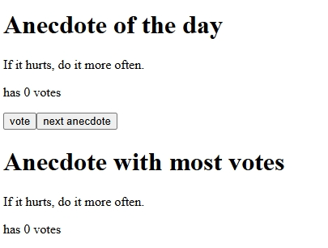

# Anecdotes App (Full Stack Open - Part 1)

A React app for exercises **1.12-1.14** of the [Full Stack Open](https://fullstackopen.com) course.  
Displays and votes for software engineering anecdotes.

## Features
- Displays random software engineering anecdotes
- Tracks votes for each anecdote
- Shows the anecdote with the most votes

## Screenshots

Preview of the app's functionality:

