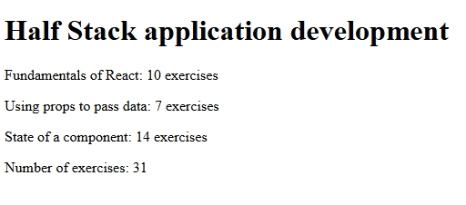

# Courseinfo (Part 1 - Full Stack Open)

A React app for exercises **1.1-1.5** of the [Full Stack Open](https://fullstackopen.com) course.  
Displays course information dynamically using React components.

## Features
- Renders a list of courses and their details.
- Demonstrates props, component composition, and state management.

## Screenshots

Preview of the app's functionality:

