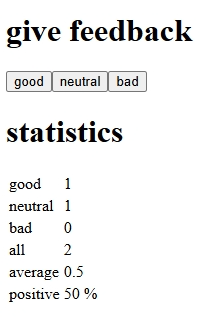

# Unicafe (Part 1 - Full Stack Open)

A React app for exercises **1.6-1.11** of the [Full Stack Open](https://fullstackopen.com) course.  
Collects and displays customer feedback statistics.

## Features
- Tracks "good", "neutral", and "bad" feedback
- Calculates total, average, and positive percentage
- Demonstrates state management and derived values

## Screenshots

Preview of the app's functionality:

