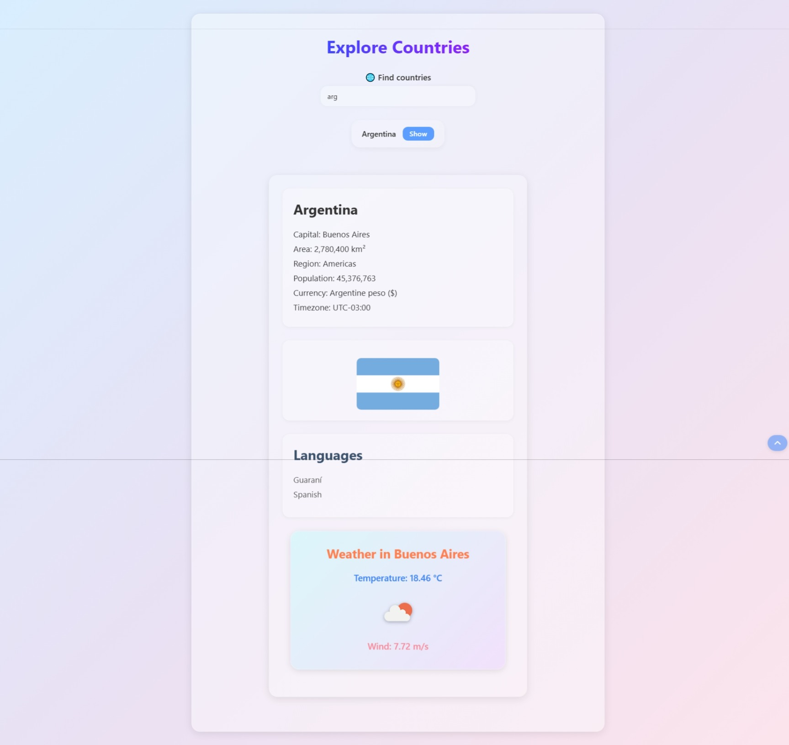

# Countries App (Full Stack Open - Part 2, 2.18–2.20)

A React app for exercises **2.18–2.20** of the [Full Stack Open](https://fullstackopen.com) course.  
Displays country details and weather info based on user input.

## Features

- Search and filter countries
- Show full details of a selected country
- Fetch weather data for the capital

## Screenshots

Preview of the app's functionality:

