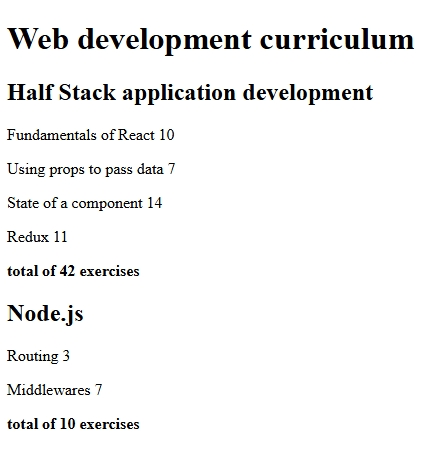

# Courseinfo Advanced App (Full Stack Open - Part 2, 2.1–2.5)

A React app for exercises **2.1–2.5** of the [Full Stack Open](https://fullstackopen.com) course.  
Displays course information with nested components and totals.

## Features

- Renders course name, parts, and exercises
- Uses reusable components and props
- Calculates total exercises per course

## Screenshots

Preview of the app's functionality:

