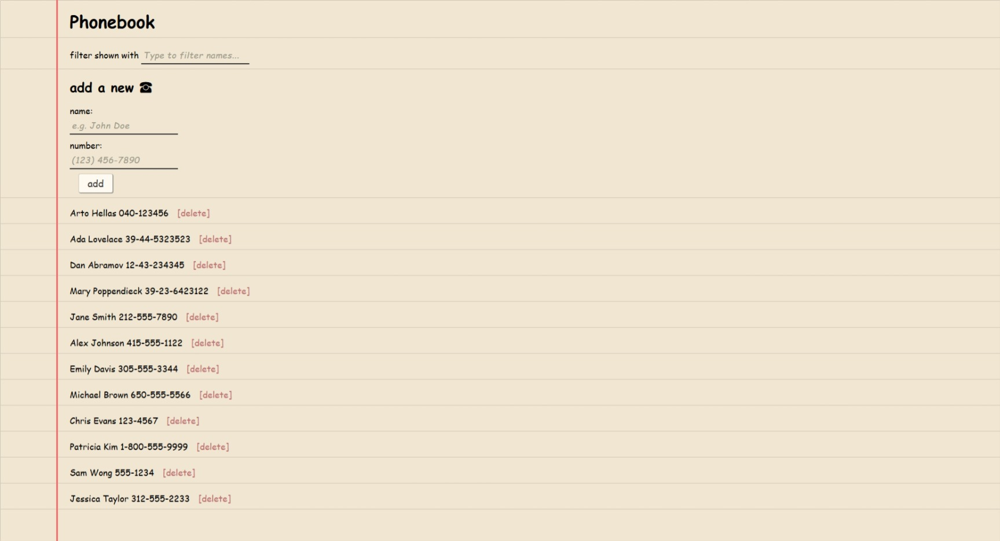

# Phonebook App (Full Stack Open - Part 2, 2.6–2.17)

A React app for exercises **2.6–2.17** of the [Full Stack Open](https://fullstackopen.com) course.  
Manages contacts with add, delete, filter, and update features.

## Features

- Add new contacts with names and numbers
- Filter contacts by name
- Show notifications for actions
- Communicates with a backend server

## Screenshots

Preview of the app's functionality:

